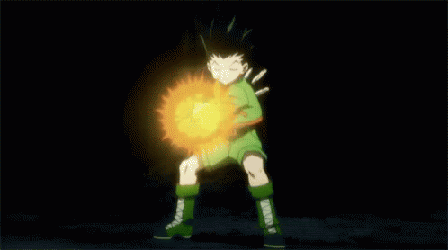

## ~ jajanken ~
[LIVE DEMO](brandonngithub.github.io/jajanken/)
 

Jajanken is a move used by Gon, a character in the Hunter x Hunter anime. The name of the move is similar to 'Janken' which is rock, paper, scissors in Japanese. The purpose of this assignment is to demonstrate basic JavaScript skills in combination with HTML and CSS. A useful skill I learned in doing this project is how to manipulate the DOM using JavaScript.

## Tech Used:
- [HTML](https://developer.mozilla.org/en-US/docs/Web/HTML)
- [CSS](https://developer.mozilla.org/en-US/docs/Web/CSS)
- [JavaScript](https://developer.mozilla.org/en-US/docs/Web/JavaScript)
- UNIX terminal
- Git

## Screenshots:

